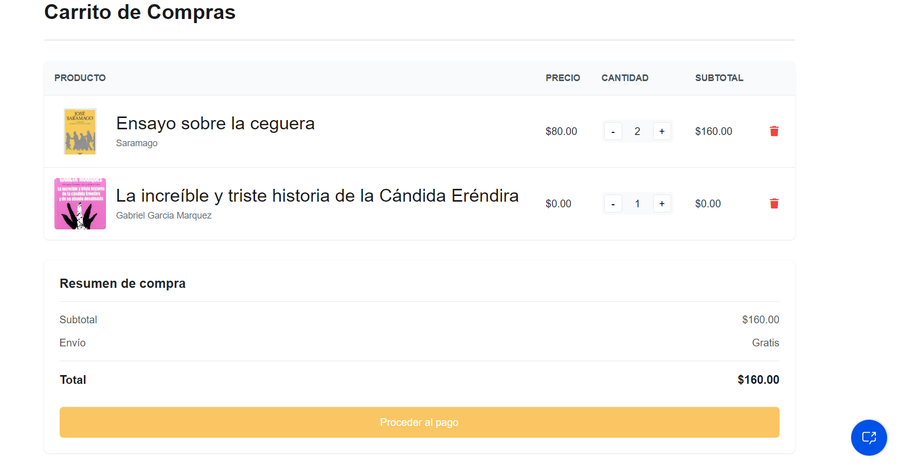

# Librería Odisea

Librería Odisea es una tienda de libros en línea que ofrece una experiencia completa para amantes de la lectura. Nuestro objetivo es combinar tecnología avanzada con la pasión por los libros, permitiendo a los usuarios disfrutar de una plataforma intuitiva y funcional.

## Características principales

- **Registro de usuarios**: Los visitantes pueden crear una cuenta personalizada para gestionar sus compras y preferencias.
- **Gestión de usuarios**: Los administradores pueden crear, editar y eliminar cuentas según sea necesario.
- **Carrito de compras**: Los clientes pueden agregar libros a su carrito, revisar sus pedidos y completar la compra.
- **Registro y CRUD de libros**: Los administradores tienen la capacidad de añadir nuevos títulos a la tienda, así como gestionar los existentes (crear, leer, actualizar, eliminar).
- **Asistente virtual 24/7**: Un bot entrenado para responder preguntas y guiar a los usuarios durante todo el día.

## Tecnología utilizada

Este proyecto ha sido desarrollado con **.NET**, aprovechando su robustez y versatilidad para construir aplicaciones web modernas.

## Galería de imágenes

A continuación, algunas capturas del proyecto:

### Imagen 1


### Imagen 2


### Imagen 3


### Imagen 4


### Imagen 5


### Imagen 6


## Instalación y uso

1. Clona este repositorio:
   ```bash
   git clone https://github.com/tu-usuario/libreria-odisea.git
